# LMS 도메인 데이터 모델

> **Source of truth:** `src/features/` 아래 각 실험의 `mockData.ts` / `store.ts`
> **최종 갱신:** 2026-03-17
> **갱신 방법:** `/erd` slash command 실행

---

## ERD (Mermaid)

```mermaid
erDiagram

  %% ── 멀티테넌시 ──────────────────────────────────────────────
  Tenant {
    string id PK
    string name
    string subdomain
    string plan "STARTER|GROWTH|ENTERPRISE"
    string status "TRIAL|ACTIVE|SUSPENDED"
    string adminEmail
    int maxUsers
    int currentUsers
    float storageUsedGB
    float storageMaxGB
    string contractStart
    string contractEnd
    string trialEndsAt
  }
  TenantInfra {
    string tenantId FK
    string awsRegion
    string dbHost
    string s3Bucket
    string ec2InstanceType
    string provisionedAt
  }
  PlanConfig {
    string id PK "STARTER|GROWTH|ENTERPRISE"
    string label
    int maxUsers
    int storageGB
    int monthlyKRW
  }
  PlatformSettings {
    string id PK "singleton"
    string serviceName
    string opsEmail
    string rootDomain
    int sessionTimeoutMin
    bool require2FAForPlatformAdmin
    int auditLogRetentionDays
    int trialDays
    int trialExpiryWarningDays
    int storageThresholdPct
  }

  Tenant ||--|| TenantInfra : "has"

  %% ── 조직 구조 ────────────────────────────────────────────────
  Site {
    string id PK
    string tenantId FK
    string name
  }
  Department {
    string id PK
    string tenantId FK
    string name
    string parentId FK "self-ref, nullable"
  }
  JobGrade {
    string id PK
    string tenantId FK
    string name
  }
  OrgSettings {
    string tenantId PK
    string name
    string contactEmail
    string brandColor
    string subdomain
    string logoUrl
  }

  Tenant ||--o{ Site : "has"
  Tenant ||--o{ Department : "has"
  Tenant ||--o{ JobGrade : "has"
  Tenant ||--|| OrgSettings : "has"
  Department ||--o{ Department : "parent-child"

  %% ── 사용자 ───────────────────────────────────────────────────
  User {
    string id PK
    string tenantId FK
    string email
    string name
    string role "LEARNER|INSTRUCTOR|ORG_ADMIN|SUPER_ADMIN"
    string status "ACTIVE|INACTIVE"
    string employeeId
    string siteId FK
    string departmentId FK
    string jobGradeId FK
    string joinedAt
    string lastLogin
    string[] idpManagedFields "SSO only"
    string authProvider "LOCAL|SSO"
  }
  UserGroup {
    string id PK
    string tenantId FK
    string name
    string description
    string createdAt
  }
  UserGroupMember {
    string groupId FK
    string userId FK
  }
  AccessLog {
    string id PK
    string tenantId FK
    string userId FK
    string userName
    string type "LOGIN|LOGOUT|SESSION_EXPIRED|AUTO_LOGIN"
    string scope "USER|ADMIN"
    string date
    string ip
    string userAgent
  }

  Tenant ||--o{ User : "has"
  User }o--o| Site : "belongs to"
  User }o--o| Department : "belongs to"
  User }o--o| JobGrade : "belongs to"
  User ||--o{ AccessLog : "generates"
  UserGroup ||--o{ UserGroupMember : "contains"
  User ||--o{ UserGroupMember : "in"

  %% ── 학습 콘텐츠 ──────────────────────────────────────────────
  Course {
    string id PK
    string tenantId FK
    string title
    string instructorId FK
    string status "PUBLISHED|DRAFT|ARCHIVED"
    string mode "ONLINE|OFFLINE|BLENDED"
    string category
    string[] tags
    int price "B2C only"
    string description
    string createdAt
  }
  CancellationPolicy {
    string courseId PK
    bool noRefundAfterStart
  }
  CancellationRule {
    string id PK
    string courseId FK
    int daysBeforeStart
    int refundPct
  }
  CourseSession {
    string id PK
    string courseId FK
    string name
    string type "SELF_PACED|COHORT"
    int cohortNumber
    string startDate
    string endDate
    int capacity
    int enrolled
    string status "DRAFT|OPEN|ONGOING|CLOSED"
    bool visible
    bool forSale
    int completionThreshold
    string location
    string[] instructors
  }
  Subject {
    string id PK
    string courseId FK
    string title
    int order
  }
  Activity {
    string id PK
    string subjectId FK
    string title
    string type "VIDEO|SCORM|QUIZ|ASSIGNMENT"
    int duration
    int questionCount
    string mediaAssetId FK
    string examTemplateId FK
    string assignTemplateId FK
  }
  OfflineSession {
    string id PK
    string courseSessionId FK
    int dayNum
    string date
    string startTime
    string endTime
    string location
    string[] instructors
    int maxCapacity
    string status "SCHEDULED|COMPLETED|CANCELLED"
  }
  AttendanceRecord {
    string id PK
    string offlineSessionId FK
    string learnerId FK
    string learnerName
    string status "PRESENT|LATE|ABSENT|EXCUSED"
    string method "QR|MANUAL"
    string checkedAt
  }

  Tenant ||--o{ Course : "owns"
  Course ||--|| CancellationPolicy : "has"
  CancellationPolicy ||--o{ CancellationRule : "defines"
  Course ||--o{ CourseSession : "has"
  Course ||--o{ Subject : "structured by"
  Subject ||--o{ Activity : "contains"
  CourseSession ||--o{ OfflineSession : "has"
  OfflineSession ||--o{ AttendanceRecord : "tracks"
  User ||--o{ AttendanceRecord : "has"

  %% ── 수강 ─────────────────────────────────────────────────────
  Enrollment {
    string id PK
    string tenantId FK
    string userId FK
    string courseSessionId FK
    string status "ACTIVE|COMPLETED|CANCELLED|EXPIRED"
    int progress
    string enrolledAt
    string lastStudiedAt
  }

  User ||--o{ Enrollment : "has"
  CourseSession ||--o{ Enrollment : "has"

  %% ── 평가 ─────────────────────────────────────────────────────
  BankQuestion {
    string id PK
    string tenantId FK
    string kind "EXAM|SURVEY"
    string type "SINGLE|MULTIPLE|TRUE_FALSE|SHORT|LIKERT|TEXT"
    string text
    string[] tags
    string createdAt
  }
  ExamTemplate {
    string id PK
    string tenantId FK
    string title
    string subType "SHORT|FINAL"
    int passingScore
    int timeLimit
    int usageCount
    string createdAt
  }
  CompositionRule {
    string id PK
    string templateId FK
    string templateKind "EXAM|SURVEY"
    string label
    string[] tagFilter
    int count
    bool shuffle
  }
  AssignmentTemplate {
    string id PK
    string tenantId FK
    string title
    string instructions
    string submissionType "FILE|TEXT|BOTH"
    int usageCount
    string createdAt
  }
  RubricItem {
    string id PK
    string assignTemplateId FK
    string criteria
    int points
  }
  SurveyTemplate {
    string id PK
    string tenantId FK
    string title
    bool anonymous
    string triggerType "MANUAL|COURSE_COMPLETE"
    int responseCount
    string status "ACTIVE|CLOSED"
    string createdAt
  }

  ExamTemplate ||--o{ CompositionRule : "has"
  SurveyTemplate ||--o{ CompositionRule : "has"
  AssignmentTemplate ||--o{ RubricItem : "has"
  Activity }o--o| ExamTemplate : "uses"
  Activity }o--o| AssignmentTemplate : "uses"

  %% ── 수료증 ───────────────────────────────────────────────────
  CertTemplate {
    string id PK
    string tenantId FK
    string name
    bool active
    int validityYears
    string backgroundImageUrl
    string htmlTemplate
  }
  IssuedCert {
    string id PK
    string tenantId FK
    string certNumber
    string publicToken
    string userId FK
    string courseId FK
    string sessionId FK
    string templateId FK
    string status "VALID|REVOKED|EXPIRED"
    string issuedAt
    string expiredAt
    string revokedAt
    string revokedReason
    string revokedBy
    string reissuedAt
  }

  CertTemplate ||--o{ IssuedCert : "generates"
  User ||--o{ IssuedCert : "receives"
  Course ||--o{ IssuedCert : "triggers"

  %% ── 미디어 ───────────────────────────────────────────────────
  MediaAsset {
    string id PK
    string tenantId FK
    string displayName
    string originalName
    string mimeType
    string assetType "VIDEO|PDF|IMAGE|SCORM"
    string size
    string status "PENDING|VALIDATING|PROCESSING|ACTIVE|ERROR"
    string cdnBaseUrl
    string launchHref
    string scormVersion "1.2|2004"
    string uploadedAt
    string errorMessage
  }

  Activity }o--o| MediaAsset : "references"

  %% ── 운영: 결제 ───────────────────────────────────────────────
  Payment {
    string id PK
    string tenantId FK
    string orderNumber
    string userId FK
    string courseSessionId FK
    string learner
    string course
    int amount
    string status "PAID|REFUNDED|CANCELLED"
    string paidAt
  }

  User ||--o{ Payment : "makes"
  CourseSession ||--o{ Payment : "for"

  %% ── 운영: 메시징 ─────────────────────────────────────────────
  MessageTemplate {
    string id PK
    string tenantId FK
    string name
    string channel "SMS|EMAIL|KAKAO"
    string subject
    string content
    string[] variables
    int charCount
    string kakaoCode
    string kakaoApproval "APPROVED|PENDING|REJECTED"
    string[] tags
    string createdAt
  }
  MessageHistory {
    string id PK
    string tenantId FK
    string sentAt
    string recipient
    int recipientCount
    string channel "SMS|EMAIL|KAKAO"
    string subject
    string preview
    string status "SENT|FAILED|SCHEDULED"
    string templateId FK
  }
  AutomationRule {
    string id PK
    string tenantId FK
    string trigger "ENROLLMENT_CREATED|COURSE_COMPLETED|..."
    string channel "SMS|EMAIL|KAKAO"
    string templateId FK
    bool active
  }
  ChannelConfig {
    string tenantId PK
    string smsSenderNumber
    string smsApiKey
    bool smsConnected
    string emailSenderEmail
    string emailSmtpHost
    int emailSmtpPort
    bool emailConnected
    string kakaoChannelId
    string kakaoChannelKey
    bool kakaoConnected
  }

  MessageTemplate ||--o{ MessageHistory : "used in"
  MessageTemplate ||--o{ AutomationRule : "bound to"
  Tenant ||--|| ChannelConfig : "has"

  %% ── 운영: 공지 ───────────────────────────────────────────────
  Announcement {
    string id PK
    string tenantId FK
    string title
    string type "ANNOUNCEMENT|SYSTEM_NOTICE"
    string target "ALL|COURSE"
    string targetCourseId FK
    string sentAt
    int views
  }

  Course }o--o{ Announcement : "targeted by"

  %% ── B2C 전용 ─────────────────────────────────────────────────
  Cart {
    string userId FK
    string courseSessionId FK
  }
  Wishlist {
    string userId FK
    string courseId FK
  }

  User ||--o{ Cart : "has"
  CourseSession ||--o{ Cart : "in"
  User ||--o{ Wishlist : "has"
  Course ||--o{ Wishlist : "in"
```



---

## 도메인별 엔티티 정의

### 멀티테넌시

#### `Tenant`
| 필드 | 타입 | 설명 |
|------|------|------|
| id | string (UUID) | PK |
| name | string | 테넌트 표시명 |
| subdomain | string | UNIQUE, `{subdomain}.lms.io` |
| plan | `STARTER\|GROWTH\|ENTERPRISE` | 구독 플랜 |
| status | `TRIAL\|ACTIVE\|SUSPENDED` | 계정 상태 |
| adminEmail | string | 테넌트 대표 관리자 이메일 |
| maxUsers | int | 플랜에 따른 사용자 한도 |
| currentUsers | int | 현재 활성 사용자 수 |
| storageUsedGB | float | 사용 중인 스토리지 |
| storageMaxGB | float | 플랜 스토리지 한도 |
| contractStart/End | datetime | 계약 기간 |
| trialEndsAt | datetime? | TRIAL 상태일 때만 존재 |

#### `TenantInfra`
AWS 인프라 프로비저닝 정보 (platform-admin 전용 뷰).
| 필드 | 타입 | 설명 |
|------|------|------|
| tenantId | FK → Tenant | 1:1 |
| awsRegion | string | 데이터 거주 리전 |
| dbHost | string | RDS 엔드포인트 |
| s3Bucket | string | 테넌트 전용 버킷 |
| ec2InstanceType | string | 앱 인스턴스 타입 |

#### `PlanConfig`
플랫폼 운영자가 정의하는 플랜 규격. Tenant.plan이 이를 참조한다.

---

### 사용자 & 조직

#### `User`
| 필드 | 타입 | 설명 |
|------|------|------|
| id | string | PK |
| tenantId | FK → Tenant | 멀티테넌시 격리 |
| email | string | UNIQUE per tenant |
| name | string | 표시명 |
| role | `LEARNER\|INSTRUCTOR\|ORG_ADMIN\|SUPER_ADMIN` | 권한 |
| status | `ACTIVE\|INACTIVE` | 계정 활성화 여부 |
| employeeId | string? | B2B 사번 |
| siteId | FK? → Site | 소속 사업장 |
| departmentId | FK? → Department | 소속 부서 |
| jobGradeId | FK? → JobGrade | 직급 |
| authProvider | `LOCAL\|SSO` | 인증 방식 |
| idpManagedFields | string[]? | SSO 사용자만. IdP가 관리하는 필드 목록 (read-only 처리 필요) |

> **⚠️ SSO 주의:** `idpManagedFields`에 포함된 필드(name, email, avatar 등)는
> LMS에서 편집 불가. 다음 SSO 로그인 시 IdP 값으로 덮어씌워짐.

#### `UserGroup`
테넌트 내 임의 그룹. 수강 배정 대상, 공지 대상 등에 활용.
`UserGroupMember` pivot 테이블로 User와 N:M.

#### `Department`
`parentId` self-reference로 트리 구조 구현. 무한 depth 허용.

---

### 학습 콘텐츠

#### `Course`
| 필드 | 타입 | 설명 |
|------|------|------|
| mode | `ONLINE\|OFFLINE\|BLENDED` | 학습 방식 |
| price | int? | B2C만 존재. B2B는 null |
| certConfig | → CertTemplate | 수료증 발급 설정 (completionRate, requireExam, autoIssue) |
| cancellationPolicy | → CancellationPolicy | 취소/환불 규정 |

#### `CourseSession`
Course의 개설 단위. 코호트(COHORT)는 기수 번호, 시작/종료일 필수.
| 필드 | 타입 | 설명 |
|------|------|------|
| type | `SELF_PACED\|COHORT` | 자기주도 vs 기수제 |
| completionThreshold | int | 수료 기준 진도율 (%) |
| targetAudience | object? | 배정 대상 필터 (departments, jobGrades, sites) |
| forSale | bool | B2C 판매 노출 여부 |
| visible | bool | 학습자 목록 노출 여부 |

#### `Subject` / `Activity`
Course 커리큘럼 트리. Course → Subject(챕터) → Activity(콘텐츠).

Activity.type별 연결 FK:
| type | FK |
|------|----|
| VIDEO / SCORM | mediaAssetId → MediaAsset |
| QUIZ | examTemplateId → ExamTemplate |
| ASSIGNMENT | assignTemplateId → AssignmentTemplate |

---

### 평가

#### `BankQuestion`
EXAM과 SURVEY 문항을 단일 뱅크로 관리. `kind`로 구분.
`tags`를 통해 ExamTemplate/SurveyTemplate의 `CompositionRule.tagFilter`와 연결.

#### `ExamTemplate` / `SurveyTemplate`
`CompositionRule` 목록으로 문항 구성 정의 (tag 기반 랜덤 추출).
ExamTemplate은 Activity에서, SurveyTemplate은 독립적으로 사용.

---

### 수료증

#### `IssuedCert`
| 필드 | 설명 |
|------|------|
| certNumber | 발급 일련번호 (사람이 읽을 수 있는 형식) |
| publicToken | URL 공개 검증용 토큰 (certNumber 대신 외부 노출) |
| status | `VALID\|REVOKED\|EXPIRED` |
| expiredAt | CertTemplate.validityYears가 null이면 영구 유효 |

---

### 운영

#### `AutomationRule`
트리거 이벤트 발생 시 자동으로 MessageTemplate을 발송.

트리거 목록:
- `ENROLLMENT_CREATED` — 수강 등록 완료
- `COURSE_COMPLETED` — 수료
- `ASSIGNMENT_DUE_D3` — 과제 마감 3일 전
- `SESSION_REMINDER_1H` — 오프라인 세션 1시간 전
- `CERTIFICATE_ISSUED` — 수료증 발급
- `ACCOUNT_INVITED` — 계정 초대

#### `ChannelConfig`
테넌트별 발송 채널(SMS/EMAIL/KAKAO) 자격증명. 민감 정보이므로 별도 암호화 저장 필요.

---

## 설계 노트

### 멀티테넌시 격리 전략

모든 핵심 엔티티에 `tenantId`를 직접 포함 (Shared Schema + Row-Level 격리).
API 레이어에서 JWT의 `tenantId` 클레임을 기반으로 모든 쿼리에 `WHERE tenant_id = ?` 자동 주입.

인프라 레이어 격리(TenantInfra)는 별도 S3 버킷과 RDS를 프로비저닝해 대용량 미디어/데이터 격리 강화.

### B2C / B2B 공통 전략

기능은 B2C·B2B 공통으로 구현. 컨텍스트에서 불필요한 UI는 **hide만** (제거 X).

| 기능 | B2C | B2B |
|------|-----|-----|
| 결제/장바구니/위시리스트 | ✓ | hide |
| SSO 프로필 편집 제한 | - | ✓ (idpManagedFields) |
| 비밀번호 변경 | ✓ | hide (SSO) |
| 테넌트 브랜딩 | - | ✓ (brandColor, logoUrl) |
| 수강 배정 (targetAudience) | - | ✓ |

### SSO idpManagedFields 처리

```
User.authProvider === "SSO"
  → idpManagedFields: ["name", "email", "avatar"]
  → UI: 해당 필드 input을 read-only 렌더링
  → API: PATCH /users/{id} 에서 idpManagedFields 포함 시 400 반환
```

### CourseSession vs Course

Course는 커리큘럼 정의. CourseSession은 실제 운영 단위.
- B2C: 한 Course에 여러 기수(COHORT) Session → 개별 결제
- B2B: Session에 targetAudience로 수강 배정, Payment 없음

### 수료증 검증 흐름

```
발급 → IssuedCert.publicToken 생성
→ 수강자에게 URL 공유: /cert/verify/{publicToken}
→ 공개 API: GET /certs/verify/{publicToken} → 인증 없이 조회 가능
```
